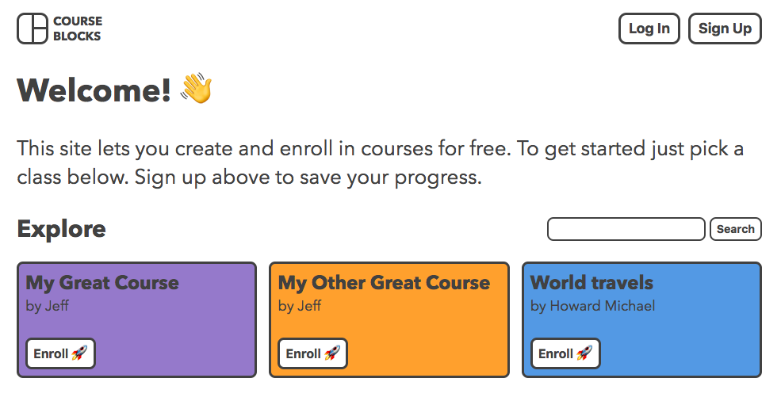
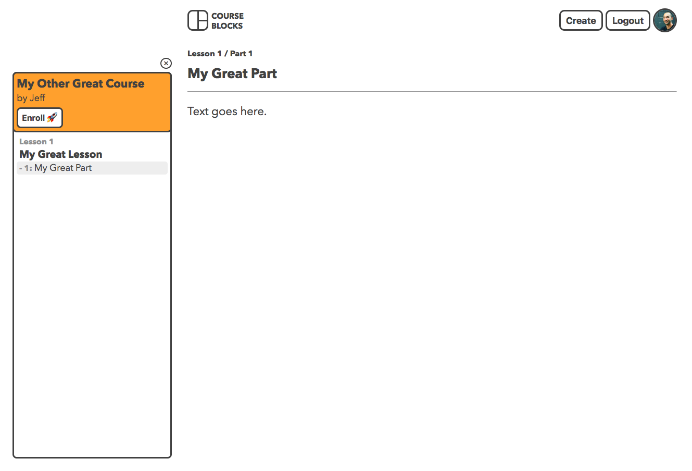
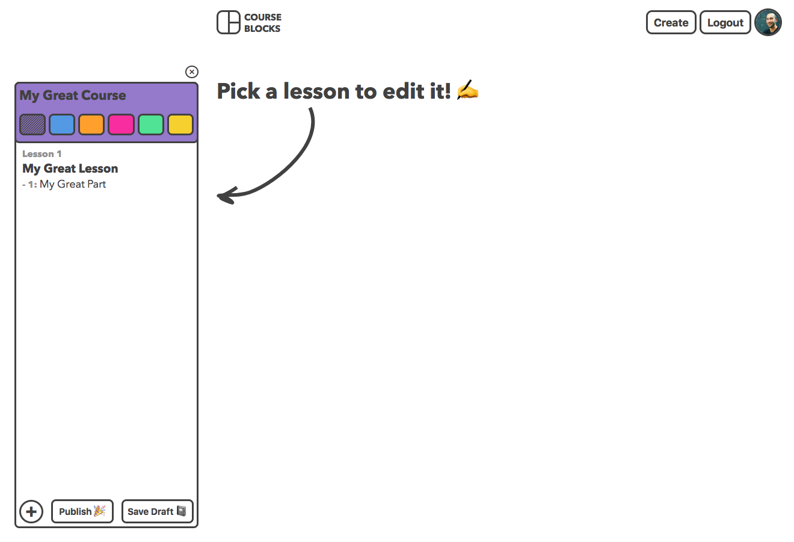
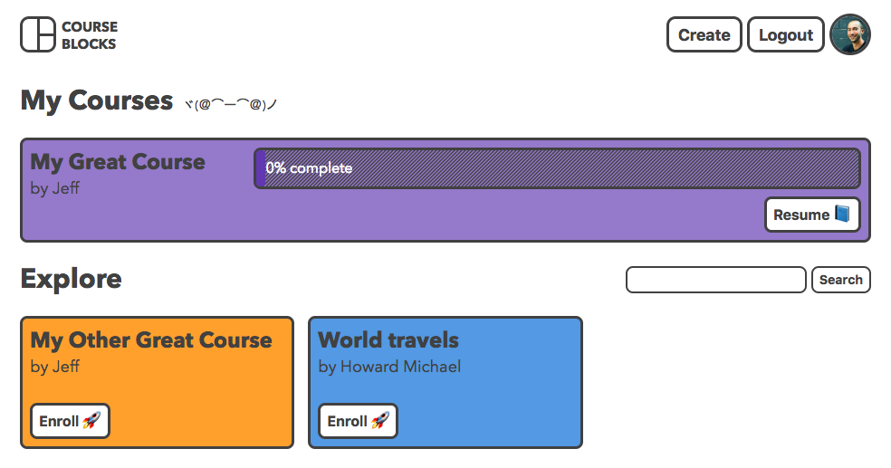

# Course Blocks

Live app: [heroku](https://course-blocks.herokuapp.com/) / [custom domain (not https)](http://www.courseblocks.io/)

This is an open source site for building and enrolling in courses. It is built in HTML/CSS/JavaScript/jQuery for the front end, and Node/MongoDB for the back end. My plan is to rebuild the front end in React after the initial iteration is complete. Please visit [this post](https://utopian.io/utopian-io/@jeffbernst/course-blocks-first-post-and-back-end) for more information about the project.

Users of the site can view courses, which look like this:

And after creating an account users can create their own courses. Here's the create course page:

They can also track the courses they're enrolled in and their progress:

## API

Course Blocks uses the following end points:

**Users (/api/users)**
- POST '/' - create new user
- POST '/login' - login existing user
- GET '/' - get user based on JWT (protected)

**Drafts (/api/drafts)**
- POST '/' - create new draft (protected)
- PUT '/' - update draft (protected)

**Courses (/api/courses)**
- POST '/' - create new course (protected)
- GET '/' - retrieve 12 courses for index page
- GET '/:courseId' - get specified course
- GET '/search/:query' - search courses
- POST '/:courseId' - enroll in course (protected)
- PUT '/:courseId' - mark part of course completed (protected) 

## Cloning Instructions

If you'd like to copy or fork this repo, there are only a few changes you'll have to make to get it up and running. 

- First run `npm install` to get all of the node modules installed. 
- The project uses a `.env` file to import the `JWT_SECRET`. Add a default secret in the `config.js` file or create your own `.env` file.
- After that it's just a matter of updating the branding and styling however you like!

_This project is licensed under the terms of the MIT license._